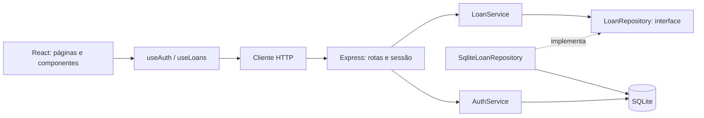

# Arquitetura do EmprestaAí

```mermaid
flowchart LR
  UI[React: páginas e componentes] --> Hook[useAuth / useLoans]
  Hook --> Client[Cliente HTTP]
  Client --> API[Express: rotas e sessão]
  API --> Service[LoanService]
  Service --> Contract[LoanRepository: interface]
  Sqlite[SqliteLoanRepository] -. implementa .-> Contract
  Sqlite --> DB[(SQLite)]
  API --> Auth[AuthService]
  Auth --> DB
```

## Responsabilidades

- `src/pages` e `src/components`: apresentação, navegação, formulários e feedback.
- `src/application`: estado da interface e operações assíncronas.
- `src/infrastructure/LoanApi.ts`: cliente HTTP, sem regras de negócio.
- `src/domain`: entidade, contrato de repositório, validação e transições do empréstimo.
- `server/app.ts`: rotas, autenticação obrigatória e conversão de erros em respostas HTTP.
- `server/AuthService.ts`: cadastro, verificação de senha e sessões.
- `server/SqliteLoanRepository.ts`: operações SQL sempre limitadas ao usuário autenticado.
- `server/database.ts`: abertura do banco e criação idempotente do esquema.

`LoanService` recebe `LoanRepository` por construtor. O servidor instancia o serviço com um repositório vinculado ao ID da sessão, mantendo as regras de domínio sem dependência de Express ou SQLite. Componentes React são funções, conforme a convenção do framework; classes são usadas para serviços e adaptadores que encapsulam comportamento.

## Regras de negócio

- Objeto, pessoa e data do empréstimo são obrigatórios.
- Datas devem existir no calendário; a previsão não pode anteceder o empréstimo.
- Um empréstimo devolvido não pode ser editado.
- Repetir a devolução preserva a primeira data registrada.
- IDs desconhecidos ou pertencentes a outra conta não expõem dados.
- O servidor gera IDs; o cliente não decide identidade nem estado de devolução.

## Segurança e persistência

As senhas são armazenadas como hash `scrypt` com salt aleatório. A sessão usa token aleatório; apenas seu hash é guardado no SQLite. O cookie é `HttpOnly` e `SameSite=Strict`, e requisições mutáveis com `Origin` de outro host são rejeitadas. Em produção com `NODE_ENV=production`, o cookie exige HTTPS. Toda consulta a empréstimos filtra por `user_id`, inclusive leitura e atualização por ID. SQL usa parâmetros, e o corpo JSON tem limite de 16 KB.

O banco é criado em `data/` por padrão, fora do Git. Para implantação, manter o arquivo em armazenamento persistente e usar HTTPS. O MVP ainda não inclui verificação de e-mail, recuperação de senha, envio de lembretes nem exclusão de conta.

## Testes

`src/domain/LoanService.test.ts` exercita validação e mudanças de estado com repositório em memória. `server/app.test.ts` inicia a API com banco SQLite temporário e verifica cadastro, login, isolamento, persistência, edição e devolução. `npm run build` verifica TypeScript do cliente e servidor e gera o front-end servido pelo Express.
